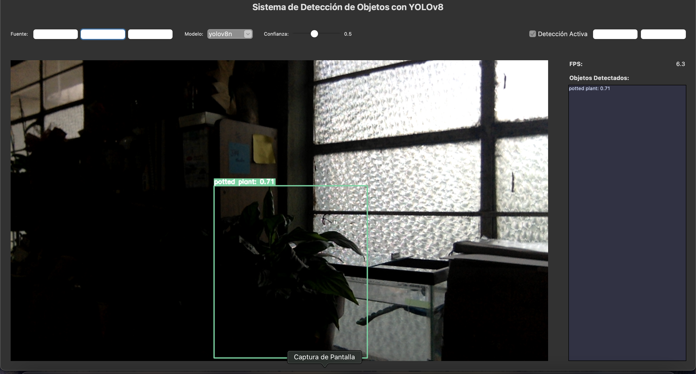

<h1 align="center">🎯 Object Detection System with YOLOv8</h1>
<p align="center">
  <em>Python desktop application with Tkinter UI for real-time object detection using Ultralytics YOLOv8</em>
</p>

<p align="center">
  
  
  
  
</p>

---

## 🌟 About the Project
**Object Detection System with YOLOv8** is a Python desktop application built with **Tkinter** that allows users to perform real-time object detection using **Ultralytics YOLOv8 models**.

It supports input from webcam, video files, and images, offering a modern, dark-themed UI with detection overlays, FPS monitoring, adjustable confidence threshold, and support for recording and screenshots.

---

## ✨ Features
✔ Load media from **webcam**, **video files**, or **images**  
✔ Real-time **YOLOv8 detection** with selectable model sizes (`n`, `s`, `m`, `l`, `x`)  
✔ **Modern UI** with Catppuccin Mocha color scheme  
✔ Adjustable **confidence threshold** with live updates  
✔ Visual display of detections with **bounding boxes**, **labels**, and **confidence scores**  
✔ **Object list panel** and **FPS monitor**  
✔ **Record detections** to video  
✔ **Capture screenshots** at any time  
✔ **Toggle detection on/off**

---

## 📸 Screenshots
| Home Screen | Detection Example 1 | Detection Example 2 | Detection Example 3 |
|-------------|---------------------|---------------------|---------------------|
|  |  |  |  |

---

## 🛠 Tech Stack
- **Language:** Python 3.x  
- **UI Framework:** Tkinter  
- **Computer Vision:** OpenCV  
- **Detection Model:** [Ultralytics YOLOv8](https://github.com/ultralytics/ultralytics)  
- **Visualization:** PIL (Pillow)  
- **Threading:** Python `threading` module  
- **Data Handling:** NumPy  

---

## ✅ Requirements
Install the dependencies:

```bash
pip install opencv-python numpy pillow matplotlib ultralytics
